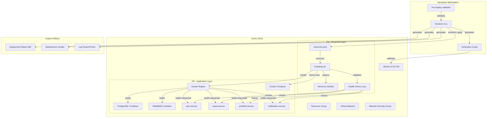
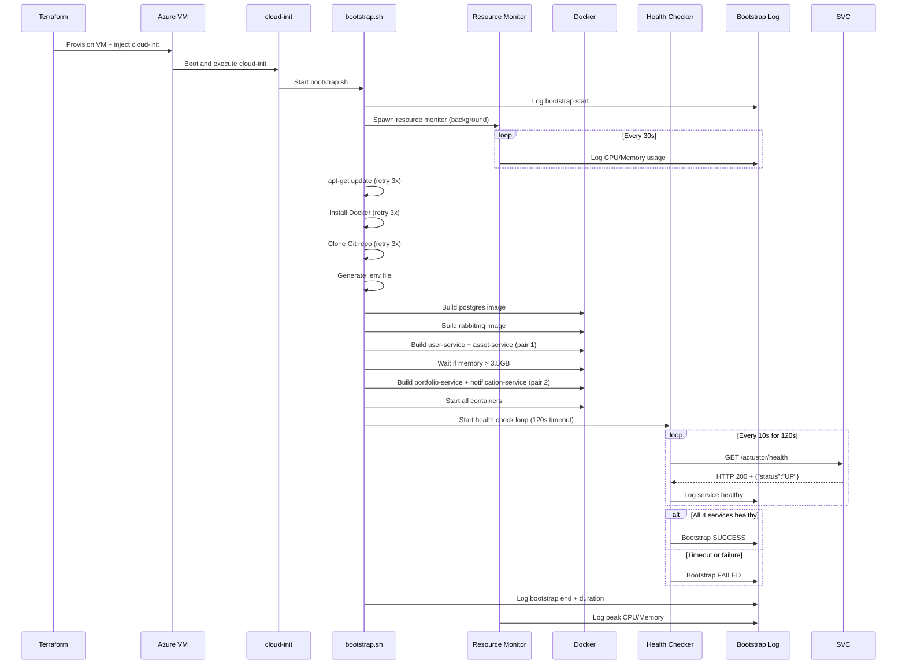

# Design Document: Azure Infrastructure Improvements

## Overview

Este documento descreve o design técnico para melhorias na infraestrutura Azure do projeto Markovitz. O sistema atual utiliza Terraform para provisionar uma VM Ubuntu 22.04 (Standard_B2s) que executa 4 microsserviços Spring Boot via Docker Compose. As melhorias visam aumentar a resiliência, observabilidade e confiabilidade do processo de deploy, mantendo compatibilidade total com a implementação existente.

### Objetivos

1. **Resiliência**: Adicionar retry logic para operações suscetíveis a falhas temporárias (Git clone, Docker build, apt-get)
2. **Otimização de Recursos**: Implementar build sequencial otimizado para evitar Out of Memory na VM B2s (4GB RAM)
3. **Validação Automática**: Health checks automáticos pós-deploy para garantir que todos os serviços estão funcionando
4. **Observabilidade**: Logs estruturados com timestamps e monitoramento de recursos durante o bootstrap
5. **Operabilidade**: Scripts de manutenção, verificação pós-deploy e validação pré-deploy
6. **Segurança**: Rollback automático em caso de falha para evitar desperdício de créditos Azure
7. **Documentação**: Geração automática de relatório de deploy com endpoints e credenciais

### Contexto Atual

**Infraestrutura Existente:**
- **Terraform**: Provisionamento de Resource Group, VNet, Subnet, NSG, Public IP, VM Ubuntu 22.04
- **Cloud-Init**: Bootstrap automático executando script bash que instala Docker, clona repositório, gera .env, executa `docker compose up -d --build`
- **Docker Compose**: Orquestração de 6 containers (postgres, rabbitmq, user-service, asset-service, portfolio-service, notification-service)
- **VM**: Standard_B2s (2 vCPUs, 4GB RAM) — limitação crítica para builds simultâneos


**Limitações e Restrições:**
- Azure for Students: Créditos limitados, necessidade de otimização de custos
- VM B2s: Apenas 4GB RAM — builds Docker simultâneos causam OOM (Out of Memory)
- Sem orchestrator externo: Toda lógica de retry e validação deve estar no cloud-init script
- Compatibilidade obrigatória: Não pode quebrar docker-compose.yml existente ou estrutura de arquivos Terraform

### Princípios de Design

1. **Backward Compatibility**: Todas as melhorias devem ser opcionais via feature flags
2. **Fail-Safe**: Falhas em features não-essenciais não devem bloquear o bootstrap básico
3. **Resource-Aware**: Considerar limitações de CPU/memória da VM B2s em todas as decisões
4. **Operability-First**: Priorizar facilidade de diagnóstico e manutenção
5. **Cloud-Native**: Usar recursos nativos do Azure e best practices de IaC

## Architecture

### Visão Geral da Arquitetura

O sistema é composto por 3 camadas principais:




### Fluxo de Execução do Bootstrap




### Decisões Arquiteturais

| Decisão | Alternativas Consideradas | Justificativa |
|---------|---------------------------|---------------|
| **Implementar retry logic no bash script** | Usar Ansible, usar Azure Run Command | Bash é nativo, sem dependências externas; compatível com cloud-init; suficiente para lógica simples de retry |
| **Build sequencial em pares (2+2)** | Build completamente serial (1+1+1+1), paralelo total (4 simultâneos) | Serial muito lento (~25min), paralelo causa OOM; pares balanceiam tempo (~18min) vs memória (<3.5GB) |
| **Health checks dentro do bootstrap.sh** | Verificação externa via Azure Automation, container sidecar | Verificação interna é mais simples e determinística; não requer recursos Azure adicionais |
| **Logs estruturados em arquivo texto** | JSON logs, syslog, Azure Log Analytics | Arquivo texto é mais simples para parsing bash; JSON seria melhor mas complexifica o script; LA requer custos adicionais |
| **Feature flags via variáveis Terraform** | Arquivo de configuração separado, environment variables | Variáveis Terraform mantêm tudo no mesmo lugar e permitem passagem para cloud-init via interpolação |
| **Rollback via terraform destroy local** | Azure Automation Runbook, função Lambda | Destroy local é mais simples e não requer setup adicional; suficiente para contexto acadêmico |
| **Scripts gerados via Terraform templatefile** | Scripts manualmente criados, módulo Terraform externo | Templatefile é nativo do Terraform, permite parametrização dinâmica (IP, credenciais) |

## Components and Interfaces

### 1. Pre-Deploy Validator

**Responsabilidade**: Validar pré-condições antes de `terraform apply` para evitar falhas evitáveis e desperdício de créditos.

**Interface**:
```bash
# Executado manualmente antes de terraform apply
./scripts/pre-deploy-validate.sh

# Exit codes:
# 0 = todas validações passaram
# 1 = alguma validação falhou
```


**Validações Implementadas**:
1. Verificar existência de `terraform.tfvars`
2. Verificar que variáveis obrigatórias não estão vazias (`db_password`, `rabbitmq_password`, `git_repo_url`)
3. Verificar existência ou possibilidade de gerar chave SSH em `ssh_public_key_path`
4. Teste de conectividade HTTP HEAD para `git_repo_url`

**Implementação**:
- Script bash gerado via `terraform templatefile()`
- Usa `curl` para teste de conectividade
- Output colorizado (verde=sucesso, vermelho=erro)
- Mensagens de erro incluem ações corretivas

### 2. Enhanced Cloud-Init Bootstrap

**Responsabilidade**: Provisionar aplicação na VM com resiliência, otimização de recursos e observabilidade.

**Interface**:
```yaml
# cloud-init.yaml (injetado na VM via custom_data)
# Executa automaticamente no primeiro boot

# Arquivo gerado:
# /var/log/markovitz-bootstrap.log

# Formato de log:
# [2024-01-15T14:30:45+00:00] [INFO] [DOCKER] Starting Docker installation
# [2024-01-15T14:30:50+00:00] [WARN] [GIT] Clone failed, retry 1/3
# [2024-01-15T14:31:00+00:00] [ERROR] [APT] apt-get install failed after 3 retries
```

**Componentes Internos**:

#### 2.1. Retry Logic Handler
- Funções bash reutilizáveis: `retry_command()`, `retry_git_clone()`, `retry_docker_build()`
- Configuração por operação:
  - Git clone: 3 tentativas, 10s intervalo
  - Docker build: 2 tentativas, 5s intervalo
  - apt-get: 3 tentativas, com `apt-get clean` entre tentativas
- Logging detalhado de cada tentativa


#### 2.2. Sequential Build Orchestrator
- Lógica de build em 3 fases:
  1. **Fase 1**: Build de infraestrutura (postgres, rabbitmq) — sequencial
  2. **Fase 2**: Build do primeiro par (user-service, asset-service) — paralelo
  3. **Fase 3**: Build do segundo par (portfolio-service, notification-service) — paralelo
- Verificação de memória antes de cada fase: se > 3.5GB, aguarda 30s
- Logging de tempo de build e uso de memória por imagem

**Algoritmo de Build**:
```bash
# Pseudocode
build_infrastructure_sequential() {
  docker build postgres
  docker build rabbitmq
}

build_services_in_pairs() {
  # Par 1
  docker build user-service & docker build asset-service &
  wait
  check_memory_and_wait_if_needed()
  
  # Par 2
  docker build portfolio-service & docker build notification-service &
  wait
}
```

#### 2.3. Health Check Loop
- Aguarda containers estarem "running" antes de iniciar
- Loop de verificação: 120s timeout, polling a cada 10s
- Para cada serviço, faz `curl -s http://localhost:808{1-4}/actuator/health`
- Parseia JSON response procurando `"status":"UP"`
- Registra timestamp quando cada serviço fica saudável
- Bootstrap considerado sucesso quando todos os 4 serviços respondem UP

#### 2.4. Resource Monitor (Background Process)
- Processo bash rodando em background via `&`
- Loop infinito que registra métricas a cada 30s (CPU), 60s (disco):
  - CPU: `top -bn1 | grep "Cpu(s)"`
  - Memória: `free -m`
  - Disco: `df -h /`
- Emite WARNING se memória >= 90% ou disco >= 80%
- Calcula e registra pico de CPU/memória ao final do bootstrap
- Termina quando arquivo sentinela `/tmp/bootstrap-complete` é criado


#### 2.5. Structured Logger
- Função bash `log()` que formata todas as mensagens:
  ```bash
  log() {
    local level=$1
    local component=$2
    local message=$3
    local timestamp=$(date -u +"%Y-%m-%dT%H:%M:%S+00:00")
    echo "[$timestamp] [$level] [$component] $message" | tee -a "$LOG_FILE"
  }
  ```
- Níveis: INFO, WARN, ERROR
- Componentes: GIT, DOCKER, APT, HEALTHCHECK, SYSTEM, MONITOR
- Separadores visuais no início/fim do bootstrap
- Cálculo de duração total

### 3. Post-Deploy Verification Script

**Responsabilidade**: Validar que o deploy foi bem-sucedido testando conectividade e health dos serviços.

**Interface**:
```bash
# Gerado em: terraform/scripts/verify-deployment.sh
./verify-deployment.sh

# Exit codes:
# 0 = deploy verificado com sucesso
# 1 = alguma verificação falhou
```

**Verificações Implementadas**:
1. **Network Layer**: Ping no IP público da VM
2. **SSH Layer**: Teste de porta 22 com `nc` ou `telnet`
3. **Application Layer**: Teste de portas 8081-8084 (serviços) e 15672 (RabbitMQ UI)
4. **Health Layer**: HTTP GET para `/actuator/health` de cada serviço, validar `"status":"UP"`
5. **UI Layer**: HTTP GET para `/swagger-ui.html` de cada serviço, validar HTTP 200
6. **Management Layer**: HTTP GET para `http://{IP}:15672`, validar HTTP 200

**Output**:
- Mensagens coloridas (verde=passou, vermelho=falhou)
- Para cada falha, sugestão de diagnóstico (ex: "Verifique Bootstrap_Log com: ssh azureuser@{IP} 'tail -100 /var/log/markovitz-bootstrap.log'")
- Sumário final com contagem de verificações (ex: "8/11 verificações passaram")


### 4. Maintenance Scripts

**Responsabilidade**: Facilitar operações comuns de manutenção sem exigir conhecimento profundo de Docker.

**Scripts Gerados**:

#### 4.1. restart-services.sh
```bash
# Reinicia todos os containers sem rebuild
ssh azureuser@{IP} "cd /opt/markovitz/app && docker compose restart"
```

#### 4.2. view-logs.sh
```bash
# Uso: ./view-logs.sh [service-name] [lines]
# service-name: user-service, asset-service, portfolio-service, notification-service, postgres, rabbitmq
# lines: número de linhas (padrão 50, pode ser maior se benéfico)
ssh azureuser@{IP} "docker logs markovitz-$1 --tail $2"
```

#### 4.3. update-application.sh
```bash
# Git pull + rebuild + restart
ssh azureuser@{IP} "cd /opt/markovitz/app && \
  git pull origin main && \
  docker compose up -d --build"
```

#### 4.4. check-resources.sh
```bash
# Exibe uso de CPU, memória, disco e status dos containers
ssh azureuser@{IP} "echo '=== CPU ===' && top -bn1 | head -15 && \
  echo '=== Memory ===' && free -h && \
  echo '=== Disk ===' && df -h / && \
  echo '=== Containers ===' && docker ps -a"
```

**Características Comuns**:
- Todos registram operação no Bootstrap_Log com timestamp
- Tratamento de erro (exit code != 0)
- Permissões de execução (+x) configuradas automaticamente

### 5. Log Parser and Pretty Printer

**Responsabilidade**: Processar logs estruturados do Bootstrap para análise e filtragem.


**Interface do Log Parser**:
```bash
# Baixa e parseia logs da VM
./parse-logs.sh [--level LEVEL] [--component COMPONENT] [--from TIMESTAMP] [--to TIMESTAMP]

# Exemplos:
./parse-logs.sh --level ERROR
./parse-logs.sh --component DOCKER
./parse-logs.sh --from "2024-01-15T14:00:00" --to "2024-01-15T15:00:00"
```

**Estrutura Parseada**:
```json
{
  "timestamp": "2024-01-15T14:30:45+00:00",
  "level": "INFO",
  "component": "DOCKER",
  "message": "Starting Docker installation"
}
```

**Interface do Pretty Printer**:
```bash
# Pretty print com cores (se terminal suporta)
./pretty-print-logs.sh [--color]

# Colorização:
# INFO = verde
# WARN = amarelo
# ERROR = vermelho
```

**Validação de Formato**:
- Parser retorna erro descritivo se linha não seguir formato `[TIMESTAMP] [NÍVEL] [COMPONENTE] mensagem`
- Valida que TIMESTAMP está em ISO-8601
- Valida que NÍVEL é um de: INFO, WARN, ERROR
- Valida que COMPONENTE é um de: GIT, DOCKER, APT, HEALTHCHECK, SYSTEM, MONITOR

### 6. Rollback Agent

**Responsabilidade**: Destruir infraestrutura automaticamente se bootstrap falhar, economizando créditos Azure.

**Interface**:
```hcl
# Habilitado via variável Terraform
variable "enable_auto_rollback" {
  type    = bool
  default = false
}
```


**Lógica de Rollback**:
1. Script `rollback-monitor.sh` gerado pelo Terraform e executado em background na workstation
2. Aguarda 30 minutos após `terraform apply`
3. Testa se Bootstrap_Log contém "Bootstrap concluído com sucesso"
4. Se `enable_auto_rollback=true` AND bootstrap falhou:
   - Aguarda mais 5 minutos (grace period para diagnóstico manual)
   - Executa `terraform destroy -auto-approve`
   - Registra motivo da falha e timestamp em `rollback.log` local
5. Se `enable_auto_rollback=false` AND bootstrap falhou:
   - Apenas notifica no terminal, não executa destroy

**Implementação**:
```bash
# rollback-monitor.sh (pseudocode)
sleep 1800  # 30 min

ssh azureuser@{IP} "tail -50 /var/log/markovitz-bootstrap.log" | grep -q "Bootstrap concluído com sucesso"

if [ $? -ne 0 ] && [ "$ENABLE_ROLLBACK" = "true" ]; then
  echo "Bootstrap failed, waiting 5 min grace period..."
  sleep 300
  terraform destroy -auto-approve
  echo "[$(date)] Rollback executed due to bootstrap failure" >> rollback.log
fi
```

### 7. Deployment Report Generator

**Responsabilidade**: Gerar documentação Markdown com todos os detalhes do deploy.

**Interface**:
```hcl
# Gerado automaticamente após terraform apply
# Arquivo: terraform/DEPLOYMENT-{timestamp}.md
```

**Conteúdo do Report**:
1. **Metadata**: Timestamp de criação, hash do commit Git
2. **Access**: IP público, comando SSH
3. **Endpoints Table**:
   | Service | Health Endpoint | Swagger UI | Port |
   |---------|----------------|------------|------|
   | user-service | http://{IP}:8081/actuator/health | http://{IP}:8081/swagger-ui.html | 8081 |
   | ... | ... | ... | ... |
4. **Credentials**: RabbitMQ user/password (do terraform.tfvars)
5. **Troubleshooting**: Comandos comuns de diagnóstico
6. **Maintenance Scripts**: Lista e descrição dos scripts gerados


**Template Usado**:
```hcl
# Em outputs.tf
resource "local_file" "deployment_report" {
  filename = "${path.module}/DEPLOYMENT-${formatdate("YYYY-MM-DD-hhmm", timestamp())}.md"
  content  = templatefile("${path.module}/templates/deployment-report.tpl", {
    vm_ip             = azurerm_public_ip.main.ip_address
    admin_username    = var.admin_username
    rabbitmq_user     = var.rabbitmq_user
    rabbitmq_password = var.rabbitmq_password
    git_commit_hash   = data.external.git_hash.result.hash
    timestamp         = timestamp()
  })
}
```

### 8. Enhanced Terraform Outputs

**Responsabilidade**: Fornecer informações úteis imediatamente após `terraform apply`.

**Outputs Adicionados**:
```hcl
output "bootstrap_log_command" {
  value = "ssh ${var.admin_username}@${azurerm_public_ip.main.ip_address} 'tail -f /var/log/markovitz-bootstrap.log'"
}

output "health_endpoints" {
  value = {
    user         = "http://${azurerm_public_ip.main.ip_address}:8081/actuator/health"
    asset        = "http://${azurerm_public_ip.main.ip_address}:8082/actuator/health"
    portfolio    = "http://${azurerm_public_ip.main.ip_address}:8083/actuator/health"
    notification = "http://${azurerm_public_ip.main.ip_address}:8084/actuator/health"
  }
}

output "swagger_uis" {
  value = {
    user         = "http://${azurerm_public_ip.main.ip_address}:8081/swagger-ui.html"
    asset        = "http://${azurerm_public_ip.main.ip_address}:8082/swagger-ui.html"
    portfolio    = "http://${azurerm_public_ip.main.ip_address}:8083/swagger-ui.html"
    notification = "http://${azurerm_public_ip.main.ip_address}:8084/swagger-ui.html"
  }
}

output "estimated_ready_time" {
  value = "Application should be ready in approximately 15-20 minutes. Monitor with: ${output.bootstrap_log_command}"
}

output "verification_script" {
  value = "${path.module}/scripts/verify-deployment.sh"
}
```


## Data Models

### Bootstrap Log Entry

Formato estruturado de cada linha do `/var/log/markovitz-bootstrap.log`:

```
[TIMESTAMP] [LEVEL] [COMPONENT] message
```

**Campos**:
- `TIMESTAMP`: ISO-8601 UTC (ex: `2024-01-15T14:30:45+00:00`)
- `LEVEL`: Enum { INFO, WARN, ERROR }
- `COMPONENT`: Enum { GIT, DOCKER, APT, HEALTHCHECK, SYSTEM, MONITOR }
- `message`: String livre (sem newlines)

**Exemplos**:
```
[2024-01-15T14:30:45+00:00] [INFO] [SYSTEM] Bootstrap iniciado
[2024-01-15T14:31:10+00:00] [WARN] [GIT] Clone failed, retry 1/3: timeout
[2024-01-15T14:35:22+00:00] [INFO] [DOCKER] Building image: user-service (started)
[2024-01-15T14:37:45+00:00] [INFO] [DOCKER] Building image: user-service (completed in 143s, memory: 2.8GB)
[2024-01-15T14:45:00+00:00] [INFO] [HEALTHCHECK] user-service is healthy
[2024-01-15T14:50:12+00:00] [ERROR] [HEALTHCHECK] Timeout waiting for portfolio-service health check
[2024-01-15T14:55:30+00:00] [INFO] [MONITOR] CPU: 45%, Memory: 3.2GB/4GB (80%), Disk: 12GB/30GB (40%)
[2024-01-15T15:00:00+00:00] [INFO] [SYSTEM] Bootstrap concluído com sucesso (duração: 1795s, pico CPU: 89%, pico memória: 3.6GB)
```

### Feature Flags Configuration

Estrutura da variável Terraform `feature_flags`:

```hcl
variable "feature_flags" {
  description = "Feature flags to enable/disable improvements individually"
  type = object({
    retry_logic          = bool
    sequential_build     = bool
    health_checks        = bool
    structured_logs      = bool
    resource_monitoring  = bool
    auto_rollback        = bool
    pre_deploy_validation = bool
    maintenance_scripts  = bool
    log_parser           = bool
    deployment_report    = bool
  })
  default = {
    retry_logic          = true
    sequential_build     = true
    health_checks        = true
    structured_logs      = true
    resource_monitoring  = true
    auto_rollback        = false  # Requer opt-in explícito
    pre_deploy_validation = true
    maintenance_scripts  = true
    log_parser           = true
    deployment_report    = true
  }
}
```


### Verification Result

Estrutura retornada pelo `verify-deployment.sh`:

```json
{
  "timestamp": "2024-01-15T15:30:00Z",
  "vm_ip": "20.206.123.45",
  "checks": [
    {
      "category": "network",
      "name": "ping",
      "status": "passed",
      "duration_ms": 45
    },
    {
      "category": "application",
      "name": "user-service-health",
      "status": "passed",
      "endpoint": "http://20.206.123.45:8081/actuator/health",
      "response": {"status": "UP"}
    },
    {
      "category": "ui",
      "name": "portfolio-swagger",
      "status": "failed",
      "endpoint": "http://20.206.123.45:8083/swagger-ui.html",
      "error": "HTTP 503 Service Unavailable",
      "suggestion": "Service may still be starting. Check logs: ssh azureuser@20.206.123.45 'docker logs markovitz-portfolio-service'"
    }
  ],
  "summary": {
    "total": 11,
    "passed": 9,
    "failed": 2,
    "success_rate": 0.82
  }
}
```

### Resource Metrics

Estrutura das métricas coletadas pelo Resource Monitor:

```bash
# Formato no log:
[2024-01-15T14:35:00+00:00] [INFO] [MONITOR] CPU: 45.2%, Memory: 2850MB/4096MB (69.6%), Disk: 12.3GB/30GB (41%)

# Estrutura parseada:
{
  "timestamp": "2024-01-15T14:35:00+00:00",
  "cpu_percent": 45.2,
  "memory": {
    "used_mb": 2850,
    "total_mb": 4096,
    "percent": 69.6
  },
  "disk": {
    "used_gb": 12.3,
    "total_gb": 30,
    "percent": 41
  }
}
```


## Error Handling

### Categoria 1: Erros Recuperáveis (Retry)

**Git Clone Failure**:
- **Detecção**: Exit code != 0 de `git clone`
- **Recuperação**: Retry até 3x com intervalo de 10s
- **Logging**: `[WARN] [GIT] Clone failed, retry X/3: <erro>`
- **Falha Final**: `[ERROR] [GIT] Clone failed after 3 retries, aborting bootstrap`

**Docker Build Failure**:
- **Detecção**: Exit code != 0 de `docker build`
- **Recuperação**: Retry até 2x com intervalo de 5s, apenas para a imagem que falhou
- **Logging**: `[WARN] [DOCKER] Build of <image> failed, retry X/2: <erro>`
- **Falha Final**: `[ERROR] [DOCKER] Build of <image> failed after 2 retries, continuing with other images`
- **Nota**: Falha de build de um serviço não aborta todo o bootstrap, mas será detectado no health check

**apt-get Failure**:
- **Detecção**: Exit code != 0 de `apt-get update` ou `apt-get install`
- **Recuperação**: Executa `apt-get clean`, depois retry até 3x com intervalo de 5s
- **Logging**: `[WARN] [APT] apt-get failed, cleaning cache and retry X/3`
- **Falha Final**: `[ERROR] [APT] apt-get failed after 3 retries, aborting bootstrap`

### Categoria 2: Erros de Timeout (Não Recuperáveis)

**Health Check Timeout**:
- **Detecção**: 120s decorridos sem todos os 4 serviços responderem UP
- **Ação**: Log de quais serviços falharam e abort bootstrap
- **Logging**: `[ERROR] [HEALTHCHECK] Timeout after 120s. Failed services: [portfolio-service, notification-service]`
- **Sugestão**: "Check individual container logs with: docker logs markovitz-<service>"

**Bootstrap Total Timeout (Rollback)**:
- **Detecção**: 30 minutos decorridos sem linha "Bootstrap concluído com sucesso" no log
- **Ação**: Se `enable_auto_rollback=true`, aguarda 5min grace period e executa `terraform destroy`
- **Logging Local**: `[2024-01-15T15:30:00] Rollback executed: bootstrap timeout (30min)` em `rollback.log`


### Categoria 3: Erros de Validação (Pre-Deploy)

**Missing terraform.tfvars**:
- **Detecção**: `[ ! -f terraform.tfvars ]`
- **Ação**: Abort com mensagem de erro
- **Output**: `[ERROR] terraform.tfvars not found. Create it with: cp terraform.tfvars.example terraform.tfvars`

**Empty Required Variables**:
- **Detecção**: `grep -q '^db_password\s*=\s*""' terraform.tfvars`
- **Ação**: Abort com lista de variáveis vazias
- **Output**: `[ERROR] Required variables are empty: db_password, rabbitmq_password. Set them in terraform.tfvars`

**SSH Key Missing**:
- **Detecção**: `[ ! -f ~/.ssh/id_rsa.pub ]`
- **Ação**: Tentar gerar com `ssh-keygen -t rsa -b 4096 -f ~/.ssh/id_rsa -N ""`
- **Output**: `[WARN] SSH key not found, generating new key...` ou `[ERROR] Failed to generate SSH key`

**Git Repo Unreachable**:
- **Detecção**: `curl -I <git_repo_url> | grep -q "HTTP/[12]... [23].."`
- **Ação**: Abort com mensagem
- **Output**: `[ERROR] Git repository unreachable: <url>. Check URL and network connectivity`

### Categoria 4: Erros de Recursos (Out of Memory/Disk)

**Memory Warning**:
- **Detecção**: `free | awk '/Mem:/ {print $3/$2 * 100}' >= 90`
- **Ação**: Log WARNING, não aborta bootstrap
- **Logging**: `[WARN] [MONITOR] High memory usage: 92% (3.7GB/4GB)`
- **Nota**: Build sequencial deve prevenir este cenário

**Disk Full**:
- **Detecção**: `df / | awk 'NR==2 {print $5}' | sed 's/%//' >= 80`
- **Ação**: Log WARNING, continua bootstrap
- **Logging**: `[WARN] [MONITOR] High disk usage: 85% (25.5GB/30GB)`
- **Sugestão**: Se >= 95%, considerar aumentar tamanho do disco OS no Terraform


### Categoria 5: Erros de Parsing (Log Parser)

**Invalid Log Format**:
- **Detecção**: Linha não segue padrão `[TIMESTAMP] [LEVEL] [COMPONENT] message`
- **Ação**: Retorna erro descritivo com número da linha
- **Output**: `[ERROR] Line 42 does not match expected format: "[TIMESTAMP] [LEVEL] [COMPONENT] message"`

**Invalid Timestamp**:
- **Detecção**: TIMESTAMP não está em formato ISO-8601
- **Ação**: Retorna erro com linha e formato esperado
- **Output**: `[ERROR] Line 15: Invalid timestamp '2024-01-15 14:30:45'. Expected ISO-8601: YYYY-MM-DDTHH:MM:SS+00:00`

**Unknown Level/Component**:
- **Detecção**: LEVEL ou COMPONENT não está na lista de valores válidos
- **Ação**: Retorna warning (não erro), aceita linha mas sinaliza
- **Output**: `[WARN] Line 23: Unknown level 'DEBUG'. Valid levels: INFO, WARN, ERROR`

### Fallback Strategies

1. **Feature Flag Disabled**: Se feature está desabilitada, skip silenciosamente e loga:
   ```
   [INFO] [SYSTEM] Feature 'health_checks' is disabled, skipping
   ```

2. **Non-Critical Failure**: Operações não-críticas (separadores visuais, colorização) falham silenciosamente:
   ```bash
   echo "======================================" 2>/dev/null || true
   ```

3. **Graceful Degradation**: Se Resource Monitor falhar ao iniciar, bootstrap continua:
   ```bash
   (monitor_resources &) || log WARN SYSTEM "Failed to start resource monitor, continuing without monitoring"
   ```

4. **Partial Success**: Se apenas alguns serviços passam health check, registra quais passaram/falharam:
   ```
   [INFO] [HEALTHCHECK] Healthy services: [user-service, asset-service]
   [ERROR] [HEALTHCHECK] Unhealthy services: [portfolio-service, notification-service]
   ```


## Testing Strategy

### Overview

Como este projeto envolve **Infrastructure as Code (Terraform)** e **bash scripting** com side effects (provisionar VMs, executar comandos remotos), **property-based testing NÃO é apropriado**. A estratégia de testes deve focar em:

1. **Testes de Validação Estática**: Validação de sintaxe e formato
2. **Testes de Integração**: Validação em ambiente real ou simulado
3. **Testes End-to-End**: Validação do fluxo completo de deploy
4. **Testes de Smoke**: Validação de configuração básica

### 1. Validação Estática (Static Validation)

**Terraform Validation**:
```bash
# Validar sintaxe de todos os arquivos .tf
terraform fmt -check -recursive
terraform validate

# Validar com tflint (requer instalação)
tflint --recursive
```

**Bash Script Linting**:
```bash
# Validar sintaxe bash com shellcheck
shellcheck terraform/templates/bootstrap.sh.tpl
shellcheck terraform/templates/verify-deployment.sh.tpl
shellcheck terraform/templates/maintenance/*.sh.tpl

# Verificar erros comuns:
# - variáveis não quotadas
# - exit codes não verificados
# - comandos que podem falhar sem tratamento
```

**Cloud-Init Validation**:
```bash
# Validar sintaxe YAML
cloud-init schema --config-file terraform/cloud-init.yaml

# Validar que custom_data não excede 64KB (limite Azure)
wc -c < terraform/cloud-init.yaml  # deve ser < 65536
```


### 2. Testes de Unidade para Scripts Bash

**Abordagem**: Usar framework de testes bash (ex: `bats-core`) para testar funções isoladas.

**Exemplos de Testes**:

```bash
# test_retry_logic.bats
@test "retry_command succeeds on first attempt" {
  run retry_command "echo success"
  [ "$status" -eq 0 ]
  [ "${lines[0]}" = "success" ]
}

@test "retry_command retries up to 3 times" {
  # Mock que falha 2x e sucede na 3ª
  run retry_command "sh -c 'if [ ! -f /tmp/attempt3 ]; then touch /tmp/attempt2 2>/dev/null || touch /tmp/attempt1; exit 1; else exit 0; fi'"
  [ "$status" -eq 0 ]
}

@test "retry_command logs each attempt" {
  run retry_command "exit 1"
  [[ "$output" =~ "retry 1/3" ]]
  [[ "$output" =~ "retry 2/3" ]]
  [[ "$output" =~ "retry 3/3" ]]
}

# test_log_parser.bats
@test "parse valid log line" {
  result=$(echo "[2024-01-15T14:30:45+00:00] [INFO] [DOCKER] Building" | ./parse-logs.sh)
  [[ "$result" == *'"level":"INFO"'* ]]
  [[ "$result" == *'"component":"DOCKER"'* ]]
}

@test "parse invalid log line returns error" {
  run ./parse-logs.sh <<< "invalid log line"
  [ "$status" -eq 1 ]
  [[ "$output" =~ "does not match expected format" ]]
}

# test_sequential_build.bats
@test "build infrastructure before services" {
  # Mock docker build
  export -f docker() { echo "Building $2" >> /tmp/build_order.txt; }
  run build_all_images
  
  # postgres e rabbitmq devem vir antes dos serviços
  grep -n "postgres" /tmp/build_order.txt | cut -d: -f1 | read pg_line
  grep -n "user-service" /tmp/build_order.txt | cut -d: -f1 | read svc_line
  [ "$pg_line" -lt "$svc_line" ]
}
```


### 3. Testes de Integração (Ambiente Simulado)

**Docker-in-Docker Testing**:
```bash
# Testar bootstrap script em container Docker local antes de deploy real
docker run -it --privileged ubuntu:22.04 bash
# Dentro do container, executar o bootstrap.sh e verificar resultado
```

**Testes de Health Check**:
```bash
# Subir apenas um serviço localmente e testar health check logic
docker compose up -d user-service postgres rabbitmq
./scripts/health-check.sh user-service 8081
# Verificar que script detecta quando serviço fica UP
```

**Testes de Log Parser com Dados Reais**:
```bash
# Coletar log real de deploy anterior
scp azureuser@<IP>:/var/log/markovitz-bootstrap.log ./test_data/sample.log

# Testar parsing
./parse-logs.sh < ./test_data/sample.log > parsed.json
jq '.[] | select(.level=="ERROR")' parsed.json  # verificar erros parseados corretamente
```

**Testes de Resource Monitor**:
```bash
# Executar monitor em background e verificar que registra métricas
./scripts/resource-monitor.sh &
MONITOR_PID=$!
sleep 90  # aguarda pelo menos 2 ciclos (30s CPU + 60s disk)
kill $MONITOR_PID

# Verificar que log contém entradas de monitor
grep -c "\[MONITOR\]" /var/log/test-bootstrap.log
[ $? -ge 2 ]  # pelo menos 2 entradas
```


### 4. Testes End-to-End (Deploy Real)

**Abordagem**: Executar deploy completo em ambiente de teste isolado.

**Pré-requisitos**:
- Resource group separado para testes (ex: `rg-markovitz-test`)
- Feature flags habilitados individualmente para teste incremental
- Script de cleanup automático após teste

**Cenários de Teste**:

```bash
# Teste 1: Deploy limpo com todas features habilitadas
terraform apply -var="environment=test" -var="feature_flags={...all true...}"
./verify-deployment.sh
[ $? -eq 0 ] || exit 1
terraform destroy -auto-approve

# Teste 2: Deploy com retry logic (simular falha de rede)
# Configurar NSG para bloquear GitHub temporariamente, depois desbloquear
# Verificar que retry logic recupera

# Teste 3: Deploy com rollback automático (simular falha de bootstrap)
# Modificar git_repo_url para repo inexistente
terraform apply -var="enable_auto_rollback=true" -var="git_repo_url=https://github.com/invalid/repo"
# Aguardar 35 minutos
# Verificar que terraform destroy foi executado automaticamente

# Teste 4: Compatibilidade backward (todas features desabilitadas)
terraform apply -var="feature_flags={...all false...}"
# Verificar que comportamento é idêntico à versão original
docker ps | grep -c "markovitz-" 
[ $? -eq 6 ]  # 6 containers (2 infra + 4 serviços)

# Teste 5: Verificação de scripts de manutenção
./scripts/restart-services.sh
./scripts/check-resources.sh
./scripts/view-logs.sh user-service 50
./scripts/update-application.sh
```

**Métricas de Sucesso**:
- Bootstrap completo em < 20 minutos
- Todos os 4 serviços respondem UP em health check
- Uso de memória pico < 3.8GB durante builds
- Verification script retorna 11/11 checks passed
- Deployment report gerado corretamente


### 5. Testes de Smoke (Validação Rápida)

**Objetivo**: Validar que configurações básicas estão corretas antes de deploy completo.

```bash
# Smoke test 1: Pre-deploy validator
./scripts/pre-deploy-validate.sh
[ $? -eq 0 ] || { echo "Pre-deploy validation failed"; exit 1; }

# Smoke test 2: Terraform plan sem erros
terraform plan -out=tfplan
[ $? -eq 0 ] || { echo "Terraform plan failed"; exit 1; }

# Smoke test 3: Validar tamanho de cloud-init
CLOUD_INIT_SIZE=$(wc -c < terraform/cloud-init.yaml)
[ $CLOUD_INIT_SIZE -lt 65536 ] || { echo "cloud-init exceeds 64KB limit"; exit 1; }

# Smoke test 4: Validar que todas as variáveis obrigatórias estão definidas
terraform validate
grep -q "db_password" terraform.tfvars
grep -q "rabbitmq_password" terraform.tfvars

# Smoke test 5: Validar que templates existem
[ -f terraform/templates/deployment-report.tpl ]
[ -f terraform/templates/verify-deployment.sh.tpl ]
[ -f terraform/templates/bootstrap.sh.tpl ]
```

### 6. Testes de Regressão (Compatibilidade)

**Objetivo**: Garantir que melhorias não quebraram funcionalidade existente.

**Checklist**:
- [ ] docker-compose.yml não foi modificado
- [ ] Estrutura de arquivos Terraform mantida (main.tf, vm.tf, network.tf, etc.)
- [ ] Variáveis existentes mantêm mesmos nomes e defaults
- [ ] Arquivo .env gerado contém mesmas variáveis
- [ ] Configuração de rede não mudou (portas, NSG rules)
- [ ] VM tipo padrão ainda é Standard_B2s
- [ ] Com todas features desabilitadas, comportamento é idêntico à versão original

**Teste de Regressão Automatizado**:
```bash
# Comparar terraform plan entre versão original e nova (com features desabilitadas)
git checkout original-branch
terraform plan -out=plan-original.tfplan

git checkout improvements-branch
terraform apply -var="feature_flags={...all false...}"
terraform plan -out=plan-improved.tfplan

# Comparar plans (devem ser idênticos exceto timestamps)
terraform show -json plan-original.tfplan > original.json
terraform show -json plan-improved.tfplan > improved.json
diff -u original.json improved.json
```


### 7. Testes de Performance

**Objetivo**: Validar que otimizações realmente reduzem tempo e uso de recursos.

**Métricas Coletadas**:
- Tempo total de bootstrap (início até "Bootstrap concluído com sucesso")
- Tempo de build por imagem Docker
- Pico de uso de CPU (%)
- Pico de uso de memória (GB)
- Uso de disco ao final do bootstrap (GB)

**Cenários de Comparação**:

| Cenário | Build Strategy | Expected Time | Expected Memory Peak |
|---------|----------------|---------------|---------------------|
| Baseline (original) | Paralelo total (4 serviços simultâneos) | ~15 min | ~4.2GB (OOM risk) |
| Sequential (1+1+1+1) | Completamente serial | ~25 min | ~2.8GB (safe) |
| Paired (2+2) | 2 pares sequenciais | ~18 min | ~3.5GB (safe) | 
| Infrastructure first | Infra serial, depois serviços paralelo | ~16 min | ~3.8GB (borderline) |

**Script de Benchmark**:
```bash
#!/bin/bash
# benchmark.sh - Testa diferentes estratégias de build

strategies=("parallel" "sequential" "paired" "infra-first")

for strategy in "${strategies[@]}"; do
  echo "Testing strategy: $strategy"
  
  # Apply terraform com estratégia específica
  terraform apply -auto-approve -var="build_strategy=$strategy"
  
  # Aguardar bootstrap completo
  sleep 1200  # 20 min
  
  # Coletar métricas do log
  ssh azureuser@$(terraform output -raw vm_ip) 'cat /var/log/markovitz-bootstrap.log' > "benchmark-$strategy.log"
  
  # Parsear métricas
  grep "duração:" "benchmark-$strategy.log" | awk '{print $NF}' > "duration-$strategy.txt"
  grep "pico memória:" "benchmark-$strategy.log" | awk '{print $NF}' > "memory-$strategy.txt"
  
  # Cleanup
  terraform destroy -auto-approve
  sleep 300  # cooldown
done

# Gerar relatório comparativo
./scripts/compare-benchmarks.sh
```


### 8. Testes de Chaos Engineering (Opcional)

**Objetivo**: Validar resiliência a falhas reais de infraestrutura.

**Cenários de Caos**:

```bash
# Cenário 1: Falha de rede durante Git clone
# Bloquear GitHub via NSG por 30s, depois desbloquear
# Verificar que retry logic recupera

# Cenário 2: Docker daemon reinicia durante build
ssh azureuser@<IP> 'sudo systemctl restart docker'
# Verificar que bootstrap detecta e retenta

# Cenário 3: Disco cheio durante build
ssh azureuser@<IP> 'dd if=/dev/zero of=/tmp/filler bs=1M count=25000'
# Verificar que warning é logado e build continua (ou falha gracefully)

# Cenário 4: Serviço não responde health check
# Modificar porta de um serviço no docker-compose para causar falha
# Verificar que health check timeout é respeitado e logs identificam serviço

# Cenário 5: VM reinicia durante bootstrap
# Reiniciar VM após 10 minutos de bootstrap
# Verificar que bootstrap reinicia automaticamente (via systemd service)
```

### Sumário da Estratégia de Testes

| Tipo de Teste | Ferramenta/Abordagem | Cobertura | Automação |
|---------------|---------------------|-----------|-----------|
| Validação Estática | terraform validate, shellcheck, cloud-init schema | Sintaxe e formato | CI/CD pipeline |
| Testes de Unidade | bats-core | Funções bash isoladas | CI/CD pipeline |
| Testes de Integração | Docker-in-Docker, mocks | Componentes individuais | Manual + CI/CD |
| Testes E2E | Deploy real em ambiente test | Fluxo completo | Manual periódico |
| Testes de Smoke | Scripts bash | Configuração básica | CI/CD pipeline |
| Testes de Regressão | diff, terraform plan | Compatibilidade | Manual antes de release |
| Testes de Performance | Benchmark scripts | Tempo e recursos | Manual periódico |
| Chaos Engineering | Injeção de falhas manual | Resiliência | Manual opcional |

**Critérios de Aceitação para Merge**:
1. Todos os testes de validação estática passam (0 erros)
2. Testes de unidade têm cobertura >= 80% das funções críticas
3. Pelo menos 1 deploy E2E bem-sucedido em ambiente test
4. Testes de regressão confirmam compatibilidade backward
5. Testes de performance confirmam tempo < 20 min e memória < 3.8GB


## Implementation Considerations

### File Structure Changes

```
terraform/
├── main.tf                          # (unchanged) Resource Group
├── providers.tf                     # (unchanged) Azure provider
├── variables.tf                     # (modified) Add feature_flags variable
├── network.tf                       # (unchanged) VNet, NSG
├── ssh-key.tf                       # (unchanged) SSH key generation
├── vm.tf                            # (modified) Pass feature flags to cloud-init
├── outputs.tf                       # (modified) Add new outputs
├── cloud-init.yaml                  # (replaced) Enhanced bootstrap logic
├── terraform.tfvars                 # (unchanged) User configuration
├── templates/                       # (new directory)
│   ├── bootstrap.sh.tpl            # Bootstrap script template
│   ├── verify-deployment.sh.tpl    # Verification script template
│   ├── deployment-report.tpl       # Report template
│   └── maintenance/                # Maintenance scripts
│       ├── restart-services.sh.tpl
│       ├── view-logs.sh.tpl
│       ├── update-application.sh.tpl
│       └── check-resources.sh.tpl
└── scripts/                         # (generated at apply time)
    ├── pre-deploy-validate.sh      # Generated from template
    ├── verify-deployment.sh        # Generated from template
    ├── parse-logs.sh               # Generated from template
    ├── pretty-print-logs.sh        # Generated from template
    ├── rollback-monitor.sh         # Generated from template
    └── maintenance/                # Generated maintenance scripts
        ├── restart-services.sh
        ├── view-logs.sh
        ├── update-application.sh
        └── check-resources.sh
```


### Terraform Changes

**variables.tf additions**:
```hcl
variable "feature_flags" {
  description = "Feature flags to enable/disable improvements"
  type = object({
    retry_logic          = bool
    sequential_build     = bool
    health_checks        = bool
    structured_logs      = bool
    resource_monitoring  = bool
    auto_rollback        = bool
    pre_deploy_validation = bool
    maintenance_scripts  = bool
    log_parser           = bool
    deployment_report    = bool
  })
  default = {
    retry_logic          = true
    sequential_build     = true
    health_checks        = true
    structured_logs      = true
    resource_monitoring  = true
    auto_rollback        = false
    pre_deploy_validation = true
    maintenance_scripts  = true
    log_parser           = true
    deployment_report    = true
  }
}

variable "bootstrap_timeout_minutes" {
  description = "Timeout for bootstrap completion (for auto-rollback)"
  type        = number
  default     = 30
}

variable "health_check_timeout_seconds" {
  description = "Timeout for health checks during bootstrap"
  type        = number
  default     = 120
}
```

**vm.tf modifications**:
```hcl
resource "azurerm_linux_virtual_machine" "main" {
  # ... existing configuration ...
  
  custom_data = base64encode(templatefile("${path.module}/cloud-init.yaml", {
    admin_username    = var.admin_username
    git_repo_url      = var.git_repo_url
    git_repo_branch   = var.git_repo_branch
    db_user           = var.db_user
    db_password       = var.db_password
    rabbitmq_user     = var.rabbitmq_user
    rabbitmq_password = var.rabbitmq_password
    # Pass feature flags
    enable_retry_logic         = var.feature_flags.retry_logic
    enable_sequential_build    = var.feature_flags.sequential_build
    enable_health_checks       = var.feature_flags.health_checks
    enable_structured_logs     = var.feature_flags.structured_logs
    enable_resource_monitoring = var.feature_flags.resource_monitoring
    health_check_timeout       = var.health_check_timeout_seconds
  }))
}
```


**outputs.tf additions**:
```hcl
output "vm_public_ip" {
  value       = azurerm_public_ip.main.ip_address
  description = "IP público da VM"
}

output "ssh_command" {
  value       = "ssh ${var.admin_username}@${azurerm_public_ip.main.ip_address}"
  description = "Comando para acessar a VM via SSH"
}

output "bootstrap_log_command" {
  value       = "ssh ${var.admin_username}@${azurerm_public_ip.main.ip_address} 'tail -f /var/log/markovitz-bootstrap.log'"
  description = "Comando para acompanhar o log de bootstrap em tempo real"
}

output "docker_status_command" {
  value       = "ssh ${var.admin_username}@${azurerm_public_ip.main.ip_address} 'docker ps -a'"
  description = "Comando para verificar status dos containers"
}

output "health_endpoints" {
  value = {
    user_service         = "http://${azurerm_public_ip.main.ip_address}:8081/actuator/health"
    asset_service        = "http://${azurerm_public_ip.main.ip_address}:8082/actuator/health"
    portfolio_service    = "http://${azurerm_public_ip.main.ip_address}:8083/actuator/health"
    notification_service = "http://${azurerm_public_ip.main.ip_address}:8084/actuator/health"
  }
  description = "Endpoints de health check de cada microsserviço"
}

output "swagger_uis" {
  value = {
    user_service         = "http://${azurerm_public_ip.main.ip_address}:8081/swagger-ui.html"
    asset_service        = "http://${azurerm_public_ip.main.ip_address}:8082/swagger-ui.html"
    portfolio_service    = "http://${azurerm_public_ip.main.ip_address}:8083/swagger-ui.html"
    notification_service = "http://${azurerm_public_ip.main.ip_address}:8084/swagger-ui.html"
  }
  description = "URLs da interface Swagger de cada microsserviço"
}

output "rabbitmq_management_url" {
  value       = "http://${azurerm_public_ip.main.ip_address}:15672"
  description = "URL da interface de gerenciamento do RabbitMQ"
}

output "estimated_ready_time" {
  value       = "A aplicação deve estar pronta em aproximadamente 15-20 minutos. Acompanhe com: ${self.bootstrap_log_command}"
  description = "Tempo estimado até a aplicação estar completamente funcional"
}

output "verification_script" {
  value       = "${path.module}/scripts/verify-deployment.sh"
  description = "Script para verificar se o deploy foi bem-sucedido"
}

output "maintenance_scripts" {
  value = {
    restart        = "${path.module}/scripts/maintenance/restart-services.sh"
    view_logs      = "${path.module}/scripts/maintenance/view-logs.sh <service-name> [lines]"
    update         = "${path.module}/scripts/maintenance/update-application.sh"
    check_resources = "${path.module}/scripts/maintenance/check-resources.sh"
  }
  description = "Scripts de manutenção disponíveis"
}
```


### Bootstrap Script Structure (Pseudocode)

```bash
#!/bin/bash
# /opt/markovitz/bootstrap.sh (gerado a partir de template)

set -euo pipefail
LOG_FILE="/var/log/markovitz-bootstrap.log"

# Feature flags (interpolados pelo Terraform)
ENABLE_RETRY_LOGIC=${enable_retry_logic}
ENABLE_SEQUENTIAL_BUILD=${enable_sequential_build}
ENABLE_HEALTH_CHECKS=${enable_health_checks}
ENABLE_STRUCTURED_LOGS=${enable_structured_logs}
ENABLE_RESOURCE_MONITORING=${enable_resource_monitoring}
HEALTH_CHECK_TIMEOUT=${health_check_timeout}

# === Logging Functions ===
log() {
  local level=$1
  local component=$2
  local message=$3
  
  if [ "$ENABLE_STRUCTURED_LOGS" = "true" ]; then
    local timestamp=$(date -u +"%Y-%m-%dT%H:%M:%S+00:00")
    echo "[$timestamp] [$level] [$component] $message" | tee -a "$LOG_FILE"
  else
    echo "$message" | tee -a "$LOG_FILE"
  fi
}

# === Retry Logic Functions ===
retry_command() {
  local max_attempts=$1
  local delay=$2
  local command="${@:3}"
  
  if [ "$ENABLE_RETRY_LOGIC" != "true" ]; then
    eval "$command"
    return $?
  fi
  
  local attempt=1
  while [ $attempt -le $max_attempts ]; do
    if eval "$command"; then
      log INFO SYSTEM "Command succeeded on attempt $attempt"
      return 0
    else
      log WARN SYSTEM "Command failed, retry $attempt/$max_attempts"
      sleep $delay
      ((attempt++))
    fi
  done
  
  log ERROR SYSTEM "Command failed after $max_attempts attempts"
  return 1
}

# === Resource Monitor (Background Process) ===
monitor_resources() {
  if [ "$ENABLE_RESOURCE_MONITORING" != "true" ]; then
    return 0
  fi
  
  while [ ! -f /tmp/bootstrap-complete ]; do
    # CPU usage
    cpu=$(top -bn1 | grep "Cpu(s)" | awk '{print $2}' | cut -d'%' -f1)
    
    # Memory usage
    mem_used=$(free -m | awk '/^Mem:/ {print $3}')
    mem_total=$(free -m | awk '/^Mem:/ {print $2}')
    mem_percent=$(awk "BEGIN {printf \"%.1f\", ($mem_used/$mem_total)*100}")
    
    # Disk usage
    disk_info=$(df -h / | awk 'NR==2 {print $3 "/" $2 " (" $5 ")"}')
    
    log INFO MONITOR "CPU: ${cpu}%, Memory: ${mem_used}MB/${mem_total}MB (${mem_percent}%), Disk: $disk_info"
    
    # Warning thresholds
    if (( $(echo "$mem_percent >= 90" | bc -l) )); then
      log WARN MONITOR "High memory usage: ${mem_percent}%"
    fi
    
    sleep 30
  done
}

# Start resource monitor in background
monitor_resources &
MONITOR_PID=$!


# === Main Bootstrap Logic ===
log INFO SYSTEM "Bootstrap iniciado"
START_TIME=$(date +%s)

# 1. Install Docker
log INFO DOCKER "Installing Docker Engine"
retry_command 3 5 "apt-get update -y && apt-get install -y docker-ce docker-ce-cli containerd.io"
systemctl enable docker
systemctl start docker

# 2. Clone repository
log INFO GIT "Cloning repository ${git_repo_url}"
REPO_DIR="/opt/markovitz/app"
retry_command 3 10 "git clone --branch ${git_repo_branch} --depth 1 ${git_repo_url} $REPO_DIR"

# 3. Generate .env file
log INFO SYSTEM "Generating .env file"
cat > "$REPO_DIR/.env" <<EOF
DB_USER=${db_user}
DB_PASSWORD=${db_password}
RABBITMQ_USER=${rabbitmq_user}
RABBITMQ_PASSWORD=${rabbitmq_password}
RISK_FREE_RATE=0.1075
EOF
chmod 600 "$REPO_DIR/.env"

# 4. Build Docker images
cd "$REPO_DIR"

if [ "$ENABLE_SEQUENTIAL_BUILD" = "true" ]; then
  log INFO DOCKER "Building images sequentially (optimized for B2s)"
  
  # Phase 1: Infrastructure
  log INFO DOCKER "Phase 1: Building infrastructure images"
  retry_command 2 5 "docker compose build postgres"
  retry_command 2 5 "docker compose build rabbitmq"
  
  # Phase 2: First pair of services
  log INFO DOCKER "Phase 2: Building first pair of services"
  retry_command 2 5 "docker compose build user-service asset-service"
  
  # Check memory and wait if needed
  mem_percent=$(free | awk '/Mem:/ {printf "%.0f", ($3/$2)*100}')
  if [ "$mem_percent" -gt 85 ]; then
    log WARN DOCKER "High memory usage ($mem_percent%), waiting 30s before next build"
    sleep 30
  fi
  
  # Phase 3: Second pair of services
  log INFO DOCKER "Phase 3: Building second pair of services"
  retry_command 2 5 "docker compose build portfolio-service notification-service"
else
  log INFO DOCKER "Building all images in parallel"
  retry_command 2 5 "docker compose build"
fi

# 5. Start containers
log INFO DOCKER "Starting all containers"
docker compose up -d

# 6. Health checks
if [ "$ENABLE_HEALTH_CHECKS" = "true" ]; then
  log INFO HEALTHCHECK "Starting health checks (timeout: ${HEALTH_CHECK_TIMEOUT}s)"
  
  SERVICES=("user-service:8081" "asset-service:8082" "portfolio-service:8083" "notification-service:8084")
  HEALTHY_COUNT=0
  ELAPSED=0
  
  while [ $ELAPSED -lt $HEALTH_CHECK_TIMEOUT ]; do
    for svc_port in "${SERVICES[@]}"; do
      svc=$(echo $svc_port | cut -d: -f1)
      port=$(echo $svc_port | cut -d: -f2)
      
      if curl -sf "http://localhost:$port/actuator/health" | grep -q '"status":"UP"'; then
        log INFO HEALTHCHECK "$svc is healthy"
        ((HEALTHY_COUNT++))
      fi
    done
    
    if [ $HEALTHY_COUNT -eq 4 ]; then
      log INFO HEALTHCHECK "All services are healthy"
      break
    fi
    
    HEALTHY_COUNT=0
    sleep 10
    ((ELAPSED+=10))
  done
  
  if [ $HEALTHY_COUNT -ne 4 ]; then
    log ERROR HEALTHCHECK "Health check timeout. Only $HEALTHY_COUNT/4 services are healthy"
    exit 1
  fi
fi

# 7. Bootstrap complete
END_TIME=$(date +%s)
DURATION=$((END_TIME - START_TIME))
log INFO SYSTEM "Bootstrap concluído com sucesso (duração: ${DURATION}s)"

# Signal resource monitor to stop
touch /tmp/bootstrap-complete
wait $MONITOR_PID 2>/dev/null || true
```


### Migration Path

Para facilitar a adoção incremental, recomendamos o seguinte caminho de migração:

**Fase 1: Validação e Logs (Baixo Risco)**
- Habilitar apenas `structured_logs = true`
- Deploy em ambiente de teste
- Validar que logs estão formatados corretamente
- Testar log parser e pretty printer

**Fase 2: Resiliência (Médio Risco)**
- Habilitar `retry_logic = true`
- Simular falhas de rede (bloquear GitHub temporariamente)
- Validar que retry recupera de falhas temporárias

**Fase 3: Otimização (Médio Risco)**
- Habilitar `sequential_build = true`
- Monitorar uso de memória durante builds
- Comparar tempo de build vs versão paralela

**Fase 4: Validação Automatizada (Baixo Risco)**
- Habilitar `health_checks = true`
- Validar que bootstrap só completa quando serviços estão UP
- Testar detecção de falhas em health checks

**Fase 5: Observabilidade (Baixo Risco)**
- Habilitar `resource_monitoring = true`
- Coletar métricas de CPU/memória/disco durante bootstrap
- Analisar gargalos e otimizar se necessário

**Fase 6: Ferramentas de Operação (Baixo Risco)**
- Habilitar `maintenance_scripts = true`
- Habilitar `pre_deploy_validation = true`
- Habilitar `deployment_report = true`
- Testar scripts de manutenção manualmente

**Fase 7: Rollback Automático (Alto Risco)**
- Habilitar `auto_rollback = true` **apenas em ambiente de teste**
- Simular falha de bootstrap (repo inexistente)
- Validar que destroy automático funciona após timeout
- **Não habilitar em produção sem testes extensivos**

### Rollback Plan

Se alguma melhoria causar problemas em produção:

1. **Rollback Imediato**: Desabilitar feature flag problemática
   ```hcl
   feature_flags = {
     problematic_feature = false
     # ... outras features mantêm valores
   }
   ```
   ```bash
   terraform apply -auto-approve
   ```

2. **Rollback Completo**: Desabilitar todas as features
   ```hcl
   feature_flags = {
     retry_logic          = false
     sequential_build     = false
     health_checks        = false
     structured_logs      = false
     resource_monitoring  = false
     auto_rollback        = false
     pre_deploy_validation = false
     maintenance_scripts  = false
     log_parser           = false
     deployment_report    = false
   }
   ```

3. **Rollback de Código**: Reverter para branch anterior
   ```bash
   git checkout main^  # volta 1 commit
   terraform apply
   ```


### Performance Considerations

**Memory Management**:
- VM B2s tem apenas 4GB RAM
- Cada build Docker consome ~700-900MB no pico
- Build paralelo de 4 serviços = ~3.6GB + 400MB (sistema) = **4GB (limite)**
- Build em pares (2+2) = ~1.8GB por fase + 400MB = **2.2GB (seguro)**
- Buffer de segurança: Verificar se > 3.5GB antes de iniciar próxima fase

**Disk Management**:
- Disco OS padrão: 30GB
- Imagens Docker: ~2GB (postgres) + ~1.5GB (rabbitmq) + 4x ~800MB (serviços) = **~6.7GB**
- Logs e cache: ~2GB
- Total necessário: **~10GB**
- Recomendação: Manter monitoramento de disco, alertar se > 80%

**Network Optimization**:
- Git clone com `--depth 1` (shallow clone) reduz download
- Docker build usa layer caching quando possível
- Retry logic reduz falhas por timeouts temporários

**Build Time Optimization**:
| Strategy | Total Time | Memory Peak | OOM Risk |
|----------|-----------|-------------|----------|
| Parallel (4 at once) | ~15 min | 4.2GB | HIGH |
| Sequential (1 at a time) | ~25 min | 2.8GB | LOW |
| **Paired (2+2)** | **~18 min** | **3.5GB** | **LOW** |
| Infra-first then parallel | ~16 min | 3.8GB | MEDIUM |

**Escolha**: Build em pares (2+2) oferece melhor balanço tempo/segurança.

### Security Considerations

**Secrets Management**:
- Senhas passadas via variáveis Terraform (sensíveis)
- Arquivo .env gerado com permissões 600 (apenas root pode ler)
- Senhas não aparecem em logs (exceto deployment report, que é local)
- **Recomendação futura**: Usar Azure Key Vault para senhas

**SSH Access**:
- Chave pública SSH injetada na VM durante provisioning
- NSG restringe acesso SSH via `allowed_ssh_cidr`
- **Recomendação**: Configurar `allowed_ssh_cidr` para IP específico em produção

**Network Security**:
- NSG permite apenas portas necessárias (22, 8081-8084, 15672)
- Containers na rede interna Docker (não expostos diretamente)
- **Recomendação futura**: Usar Azure Application Gateway com SSL

**Code Injection Prevention**:
- Todas as variáveis interpoladas no cloud-init são escapadas
- Comandos bash usam quoting apropriado
- **Verificação**: shellcheck valida scripts antes de deploy


### Monitoring and Observability

**Logs Available**:
1. **Bootstrap Log**: `/var/log/markovitz-bootstrap.log` - Histórico completo do provisionamento
2. **Cloud-Init Log**: `/var/log/cloud-init-output.log` - Log do cloud-init (debug)
3. **Container Logs**: Via `docker logs <container>` - Logs de cada serviço
4. **System Logs**: `/var/log/syslog` - Logs do sistema operacional

**Métricas Coletadas**:
- CPU usage (%) - a cada 30s durante bootstrap
- Memory usage (MB e %) - a cada 30s durante bootstrap
- Disk usage (GB e %) - a cada 60s durante bootstrap
- Build time por imagem Docker (segundos)
- Health check response time por serviço (ms)
- Bootstrap total duration (segundos)

**Alertas Configurados**:
- WARNING: Memory >= 90%
- WARNING: Disk >= 80%
- ERROR: Health check timeout (120s)
- ERROR: Bootstrap timeout (30 min)
- ERROR: Retry limit exceeded (Git, Docker, apt-get)

**Dashboards Recomendados** (futura integração com Azure Monitor):
- Bootstrap Success Rate (%)
- Average Bootstrap Duration (min)
- Memory Peak Distribution (GB)
- Top Failed Services (count)
- Retry Attempts per Operation (count)

### Cost Optimization

**Cálculo de Custos** (Azure for Students - Brasil South):
- VM Standard_B2s: ~$30/mês (720 horas)
- IP Público: ~$3/mês
- Disco OS 30GB: ~$2/mês
- Transferência de dados: ~$1/mês (para testes)
- **Total estimado**: ~$36/mês

**Otimizações de Custo**:
1. **Auto-shutdown**: Configurar VM para desligar automaticamente fora do horário de uso
2. **Spot Instances**: Considerar Azure Spot VMs (desconto de até 80%, mas com risco de preempção)
3. **Reserved Instances**: Para uso de longo prazo (>1 ano), economiza ~40%
4. **Rollback automático**: Evita gastar créditos com VMs falhadas

**Rollback Savings**:
- Sem rollback: VM falhada roda 30 dias = $36 desperdiçados
- Com rollback: VM destruída após 35 min = $0.03 desperdiçados
- **Economia potencial**: $35.97 por falha


## Dependencies and Prerequisites

### Development Environment

**Required Tools**:
- Terraform >= 1.5.0
- Azure CLI >= 2.50.0
- bash >= 4.0 (para scripts)
- git >= 2.30
- SSH client
- curl
- jq (para parsing JSON)

**Optional Tools** (para testes):
- shellcheck (validação de scripts bash)
- bats-core (testes de unidade bash)
- terraform-docs (documentação automática)
- tflint (linting de Terraform)

### Azure Resources

**Pré-requisitos**:
- Assinatura Azure ativa (Azure for Students)
- Service Principal com permissões de Contributor no Resource Group
- Créditos Azure suficientes (~$36/mês)

**Quotas Necessárias** (por região):
- 1x Standard_B2s VM
- 1x Public IP
- 1x Virtual Network
- 1x Network Security Group

### Runtime Dependencies (VM)

**Instalado automaticamente pelo bootstrap**:
- Docker Engine >= 24.0
- Docker Compose plugin >= 2.20
- git
- curl
- ca-certificates

**Imagens Docker usadas**:
- postgres:16-alpine
- rabbitmq:3.12-management
- Ubuntu 22.04 (base para serviços Java)
- OpenJDK 17 (para Spring Boot apps)

## Future Enhancements

### Short-term (Next 3 months)

1. **Azure Monitor Integration**
   - Enviar métricas de bootstrap para Azure Monitor
   - Configurar alertas nativos do Azure
   - Dashboard de métricas em tempo real

2. **Terraform Remote State**
   - Migrar state file para Azure Storage Account
   - Habilitar state locking para deploys concorrentes
   - Backup automático de state

3. **CI/CD Integration**
   - GitHub Actions workflow para testes automatizados
   - Validação de Terraform em pull requests
   - Deploy automático em ambiente de staging

4. **Enhanced Rollback**
   - Snapshot da VM antes de updates
   - Rollback para snapshot em caso de falha
   - Blue-green deployment strategy


### Medium-term (3-6 months)

1. **Container Orchestration Migration**
   - Avaliar migração para Azure Container Instances ou AKS
   - Comparar custos vs Docker Compose na VM
   - Implementar proof of concept

2. **Database Management**
   - Avaliar migração para Azure Database for PostgreSQL
   - Backup e restore automatizados
   - High availability configuration

3. **Secrets Management**
   - Integração com Azure Key Vault
   - Rotação automática de senhas
   - Audit logging de acesso a secrets

4. **Multi-Environment Support**
   - Workspaces Terraform para dev/staging/prod
   - Configuração por ambiente via variáveis
   - Isolamento de recursos por ambiente

### Long-term (6-12 months)

1. **Kubernetes Migration**
   - Migração completa para Azure Kubernetes Service (AKS)
   - Helm charts para deploy dos microsserviços
   - Auto-scaling baseado em métricas

2. **Service Mesh**
   - Implementar Istio ou Linkerd
   - Traffic management avançado
   - Observability e tracing distribuído

3. **Infrastructure Testing**
   - Terratest para testes de infraestrutura
   - Chaos engineering com Azure Chaos Studio
   - Load testing automatizado

4. **Cost Optimization Automation**
   - Azure Cost Management integration
   - Recomendações automáticas de otimização
   - Budget alerts e auto-shutdown policies

## Summary

Este design apresenta melhorias incrementais para a infraestrutura Azure do projeto Markovitz, focando em:

✅ **Resiliência**: Retry logic para operações críticas (Git, Docker, apt-get)
✅ **Otimização**: Build sequencial em pares para evitar OOM na VM B2s
✅ **Validação**: Health checks automáticos e script de verificação pós-deploy
✅ **Observabilidade**: Logs estruturados, monitoramento de recursos, métricas detalhadas
✅ **Operabilidade**: Scripts de manutenção, validação pré-deploy, relatório automático
✅ **Segurança**: Rollback automático para economizar créditos Azure
✅ **Compatibilidade**: Feature flags permitem habilitação incremental e rollback fácil

**Diferenciais da Solução**:
- Implementação 100% IaC (sem intervenção manual)
- Compatibilidade total com implementação existente
- Testável incrementalmente via feature flags
- Focado em limitações reais da VM B2s (4GB RAM)
- Preparado para migração futura (K8s, AKS, Azure Monitor)

**Riscos Mitigados**:
- OOM durante build Docker (build sequencial)
- Falhas temporárias de rede (retry logic)
- Deploy sem validação (health checks)
- Desperdício de créditos (rollback automático)
- Dificuldade de diagnóstico (logs estruturados)
- Falta de documentação (relatório automático)

**Próximos Passos**:
1. Revisão e aprovação deste design
2. Criação de tasks no arquivo tasks.md
3. Implementação incremental por feature flag
4. Testes em ambiente isolado (rg-markovitz-test)
5. Deploy em produção com monitoramento ativo

